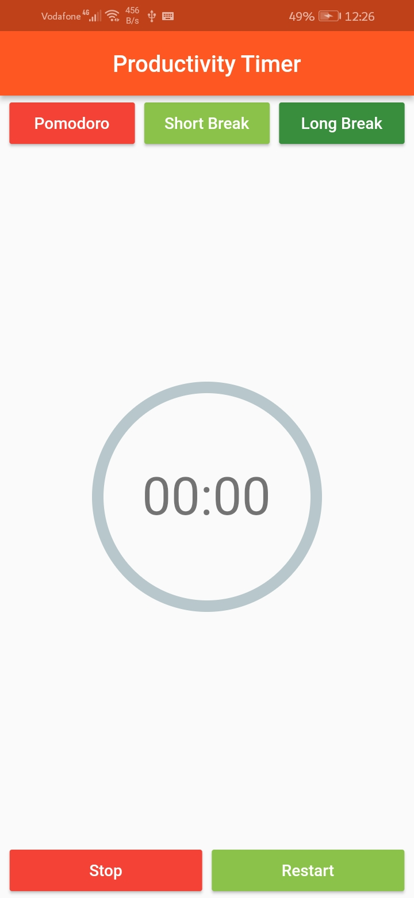
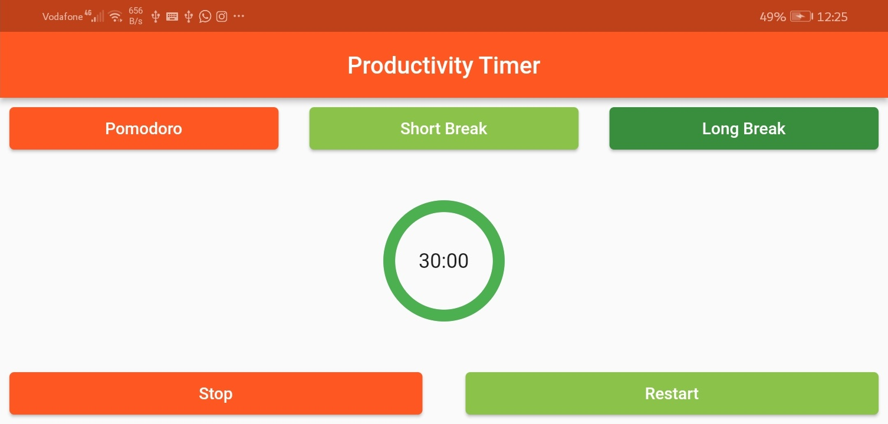

# Productivity Timer

A new Flutter project. To know the features of Rows and Columns.

# Covered:
## Rows and Columns
### Main & CrossAxisAlignment
* start, center and end
* spaceEvenly, spaceBetween and spaceAround
### VerticalDirection
* up, down
### TextDirection
* ltr, rtl

## Expanded
* flex

## MediaQuery
* size.width
* size.height

# Packages used
* keep_screen_on => to keep the screen on when the timer is on.
* percent_indicator
* assets_audio_player

### Main purposes of this project:
* How to employ the container to achieve what I want.

#### Project Pages:
- Productivity Timer 

## ScreenShots

  
  
   
   

  

